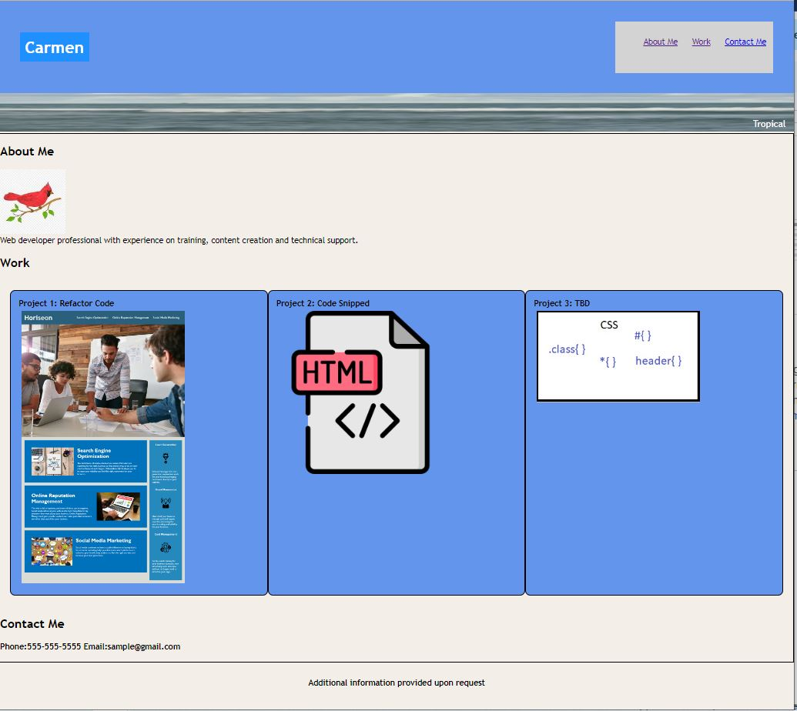

# Professional-Portfolio

#Description

This project designs the structure and style of a professional portfolio using HTML and CSS.

-This project gave me the motivation to use html and css create a space where I can showcase my expertise. My goal in this project is to produce a webpage with About Me, Work and Contact Me sections and display examples of my projects.
During this project, I learned:
how to create a new project in GitHub
how to add issues or tasks to a project in Git Hub.

#Usage

![Webpage link] https://clcoder2425.github.io/Professional-Portfolio/

![Github repository link] https://github.com/clcoder2425/Professional-Portfolio.git
